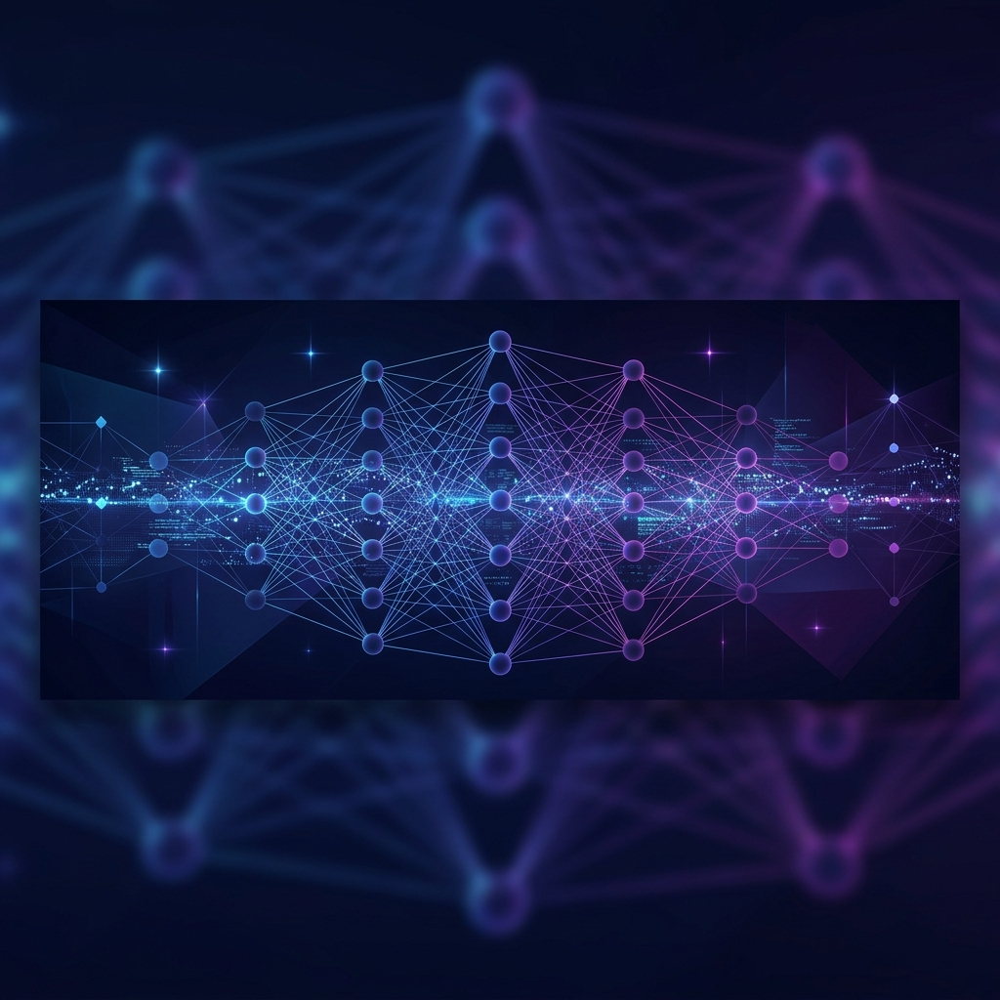

# Vishnu N (vishnun0027)

  
  
   

  <h1>Hi there, I'm Vishnu N 👋</h1>
  
  

  

    <strong>AI/ML Engineer specializing in end-to-end intelligent systems</strong> 
    Bengaluru, India 📍
  

  

    
    
    
  

---

### 🚀 About Me

I am an **AI/ML Engineer** with deep expertise in constructing and deploying production-ready intelligent systems. From **RAG pipelines** and **Large Language Models (LLMs)** to **Computer Vision** and **Cybersecurity Threat Detection**, I bridge the gap between advanced research and scalable engineering.

- 🔭 **Current Focus**: Engineering RAG-powered intelligence systems at **Sequretek**.
- 🧠 **Specialties**: Generative AI, Agentic Workflows (LangGraph/CrewAI), Transformers, and Anomaly Detection.
- ⚡ **Philosophy**: Designing AI architectures that don't just "work," but drive real business automation and decision-making at scale.

---

### 🛠️ Technical Arsenal

| Category | Skills & Tools |
| :--- | :--- |
| **Generative AI** | `LLMs` `RAG` `Agentic AI` `LangChain` `LangGraph` `CrewAI` `Vector DBs (Qdrant, ChromaDB)` `Prompt Engineering` |
| **Machine Learning** | `NLP` `Transformers` `Fine-tuning (PEFT/LoRA)` `PyTorch` `TensorFlow` `Scikit-learn` `Anomaly Detection` |
| **Deep Learning** | `Neural Networks` `CNN` `RNN` `LSTM` `OCR` `Computer Vision (OpenCV)` |
| **Infrastructure** | `Docker` `CI/CD (GitHub Actions)` `Linux` `FastAPI` `UV` |
| **Databases** | `PostgreSQL` `MongoDB` `Neo4j` `Redis` |

---

### 💼 Professional Journey

#### **Software Engineer** | [Sequretek](https://sequretek.com/)
*Dec 2024 – Present | Bengaluru, India*

> Building enterprise-grade security platforms powered by AI.

*   **RAG Search Engine**: Engineered a scalable RAG-based investigation layer using LangGraph and Vector DBs to automate security investigations.
*   **Threat Detection**: Developed DGA and anomaly detection models for real-time behavioral threat analysis.
*   **LLM Threat Hunting**: Led POC for natural language querying over security telemetry to empower SOC analysts.

#### **Junior Machine Learning Engineer** | GBS Plus
*Jan 2023 – Apr 2024 | Trivandrum, India*

*   **Facial Analysis**: Built deep learning models for landmark detection and emotion recognition.
*   **Document OCR**: Developed a multimodal LLM-based OCR system for intelligent data extraction.

---

### 📊 GitHub Powerups

  
  

  

---

  
<i>"Turning data into intelligence, one model at a time."</i>

  

